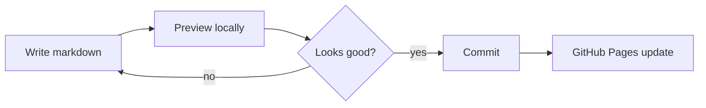

# How we added the blog and living updates

This post is more than an update note. It is a working sample for future publications: frontmatter, illustrations, a Mermaid diagram, a LaTeX formula, and a reusable structure.

## What changed

We added two layers on top of the static portfolio:

- a notification center on the landing page;
- a dedicated blog section with markdown sources and an asset directory.


The notifications are still static, but they feel like a living part of the site. The data lives in `assets/js/notifications.js`, and viewed items are remembered with `localStorage`.

## Why no admin panel

A protected admin panel for GitHub Pages would require authentication, file uploads, repository writes, and separate deployment logic. For this site, a local publishing workflow is simpler and more reliable:



This keeps the site fully static while leaving room for a future markdown → HTML generator.

## Blog structure

```text
blog/
  index.html
  posts/
    blog-launch.html
  content/
    blog-launch.ru.md
    blog-launch.en.md
  assets/
    landing-notifications.png
    blog-index.png
```


Markdown files are the source. HTML pages are what visitors read. This structure works well with GitHub Pages, keeps the site's visual language consistent, and leaves a clean path for automation later.

## LaTeX example

Technical notes benefit from formulas. For example, the publishing cost can be described as:

$$
C_{publish} = C_{write} + C_{review} + C_{preview}
$$

The point is simple: publishing should stay inexpensive in effort, otherwise the blog will stop being updated.

## What to copy for the next post

For the next post, reuse this pattern:

1. Create `*.ru.md` and `*.en.md`.
2. Put images in `blog/assets/`.
3. Preview the page locally.
4. Commit the finished version.

A static site does not have to feel frozen. When it has dates, updates, notes, and a clear publishing process, it already feels like a working product.
