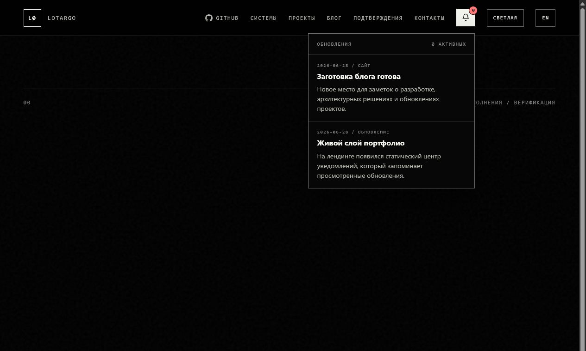
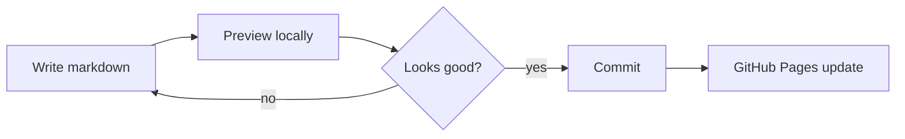

# Как мы добавили блог и живые уведомления

Этот пост — не просто запись об обновлении сайта. Он нужен как рабочий образец для будущих публикаций: с frontmatter, иллюстрациями, Mermaid-диаграммой, LaTeX-формулой и понятной структурой.

## Что изменилось

Мы добавили два слоя поверх статического портфолио:

- центр уведомлений на главной странице;
- отдельный раздел блога с markdown-исходниками и папкой для ассетов.



Уведомления остаются статическими, но воспринимаются как живая часть сайта. Данные лежат в `assets/js/notifications.js`, а просмотренные записи запоминаются через `localStorage`.

## Почему без админки

Защищённая админка для GitHub Pages потребовала бы авторизацию, загрузку файлов, запись в репозиторий и отдельную логику деплоя. Для текущего сайта проще и надёжнее локальный publishing workflow:



Такой путь оставляет сайт полностью статическим, но не мешает постепенно добавлять генератор markdown → HTML.

## Как устроен блог

```text
blog/
  index.html
  posts/
    first-note.html
  content/
    blog-launch.ru.md
    blog-launch.en.md
  assets/
    landing-notifications.png
    blog-index.png
```


Markdown-файлы — это источник. HTML-страницы — то, что читает посетитель. Такая схема хорошо работает с GitHub Pages, сохраняет общий визуальный язык сайта и даёт место для будущей автоматизации.

## Пример LaTeX

Для технических заметок полезно иметь формулы. Например, оценку стоимости публикации можно записать так:

$$
C_{publish} = C_{write} + C_{review} + C_{preview}
$$

Смысл простой: публикация должна оставаться дешёвой по усилиям, иначе блог быстро перестанет обновляться.

## Что брать как шаблон

Для следующего поста достаточно скопировать этот подход:

1. Создать `*.ru.md` и `*.en.md`.
2. Положить изображения в `blog/assets/`.
3. Проверить страницу локально.
4. Закоммитить готовую версию.

Статический сайт не обязан быть мёртвым. Если у него есть даты, обновления, заметки и понятный процесс публикации, он уже ощущается как работающий продукт.
