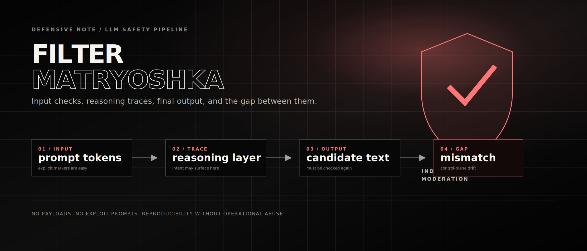

# The Filter Matryoshka: Notes on Gemini Safety Layers

This is a defensive note about a strange moderation behavior I observed while comparing local and cloud LLMs in 2025–2026. The payloads and exact prompts are intentionally omitted. The useful part is not the bypass. The useful part is the architecture smell.



## What I observed

The rough pattern was simple. If unsafe content was present directly in the incoming prompt, the request was blocked. If the model surfaced the unsafe intent in a visible reasoning or self-check trace, the run was also much more likely to be blocked. But in one class of tests, the incoming text stayed neutral, the reasoning trace did not expose the dangerous category, and the final answer still crossed a policy boundary.

That does not prove that Gemini has no output filtering. Google documentation explicitly describes response safety feedback, blocked candidates, and finish reasons such as `SAFETY`, `SPII`, and `PROHIBITED_CONTENT`. The more accurate conclusion is narrower: in some configurations, the final-output layer can appear weaker than the combined input + reasoning/self-check layer.

## Layers

| Layer | What it catches well | Failure smell |
| --- | --- | --- |
| Input moderation | Explicit markers in user text | Neutral social framing can hide intent |
| Reasoning / self-check | Intent that becomes explicit during planning | If the trace stays clean, the signal may disappear |
| Final-output moderation | Generated unsafe text after decoding | May miss cases not pre-announced by earlier layers |
| Application policy | Domain-specific rules and escalation | Often absent in quick prototypes |

## Why reasoning changes the picture

Reasoning is usually discussed as a quality feature: better planning, better code, better math, better decomposition. But from a safety perspective it can also behave like an intent-detection surface. If the model says, even internally or in a summarized trace, what it is about to do, the surrounding system has a much easier time classifying the run.

This creates a subtle dependency. A product may look safer when reasoning is on because unsafe intent becomes visible earlier. The same product may become less predictable if reasoning is hidden, minimized, summarized too aggressively, or shaped by instructions that interfere with the trace format. That is not a reason to expose private chain-of-thought. It is a reason to avoid treating reasoning as the only safety tripwire.

## The control-plane problem

The most interesting part is not the content category. It is the architectural boundary. Prompt checks and reasoning checks belong to the control plane: they decide whether the run should continue. Final-output moderation belongs to the data plane: it inspects the artifact that will actually leave the system.

A robust safety system should not allow the data plane to become less protected just because the control plane did not see a bad signal earlier. The final answer is what the user receives. Therefore the final answer deserves its own strong, independent moderation pass.

```text
Prompt check -> Reasoning trace -> Candidate output -> Independent final moderation
```

## What I would log in a responsible report

The test should be reproducible without publishing an operational jailbreak. That means the report should describe the shape of the failure, not provide a ready-to-use exploit string.

1. Model name, endpoint, date, region, and API/UI mode.
2. Safety settings and blocking thresholds.
3. Whether thinking/reasoning was on, off, minimal, or automatic.
4. Whether streaming was used.
5. Whether `promptFeedback` was empty or blocked.
6. Whether the final candidate had `finishReason: STOP` or a safety finish reason.
7. Whether `safetyRatings` included the relevant category and probability.
8. How many repeated runs reproduced the mismatch.

## What the fix probably looks like

The defensive lesson is not “never use reasoning” and not “filtering is fake”. The lesson is to make moderation layered and independent:

- check the prompt before generation;
- use reasoning summaries or internal traces as additional signal, not as the only signal;
- moderate the final text that will be delivered to the user;
- treat tool calls, agent outputs, and streaming chunks as separate surfaces;
- log enough metadata to diagnose false negatives without storing unnecessary sensitive content.

The scary version of the bug is a system where the model is safe only when it happens to confess the unsafe plan before answering. That is not a reliable safety boundary. A safe product should catch the final artifact even when the path toward it looked harmless.

## Sources

- [Gemini API: Safety settings](https://ai.google.dev/gemini-api/docs/safety-settings)
- [Google Cloud: Safety and content filters](https://docs.cloud.google.com/gemini-enterprise-agent-platform/models/capabilities/configure-safety-filters)
- [Gemini API: Thinking](https://ai.google.dev/gemini-api/docs/thinking)
