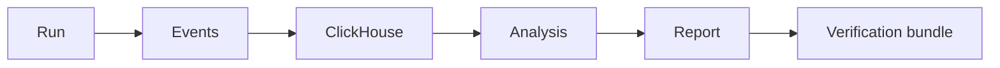

# Logs Are Not Memory: Why Research Projects Need ClickHouse and a DS/ML Layer

A small project can survive on `print`, terminal history, and a few screenshots. A research project cannot.

The moment a system starts producing versions, sweeps, candidate traces, evaluator verdicts, latency samples, failed runs, penalty curves, and reproducibility bundles, it stops being only a program. It becomes a source of experimental data.

That is the moment where a DS/ML layer becomes part of engineering hygiene, not decoration.

## The problem is not storage. The problem is memory.

Logs answer the question: what happened somewhere?

A research database answers better questions:

- what changed after this commit?
- which backend fails more often?
- which configs converge faster?
- which domains produce evaluator disagreements?
- which “successful” runs were actually contaminated by shortcuts?
- which result can still be reproduced two months later?

A terminal log is a trace. A dataset is memory.



## Postgres is state. ClickHouse is observation.

PostgreSQL is excellent when the system needs consistent state: users, tasks, relations, configs, artifact metadata, queues, permissions, and application objects.

ClickHouse is built for a different type of data: append-only analytical events. Its official docs describe it as a high-performance column-oriented SQL DBMS for OLAP. OLAP queries routinely aggregate over large datasets, and columnar layout helps because analytical queries usually read only a subset of columns.

So the point is not “ClickHouse instead of Postgres”. The point is this:

> Postgres stores what the system is. ClickHouse stores what the system did.

| Layer | Best fit | Why |
|---|---|---|
| PostgreSQL | current state | transactions, relations, constraints, integrity |
| ClickHouse | event history | append-only metrics, time-series, aggregations, high ingest |
| verification-lab | evidence | manifests, hashes, CSV/JSONL exports, audit reports |

## Why this matters for research systems

Consider a neuro-symbolic engine or a binary compute router. A single successful run is not enough. You need to know how it behaved across many runs.

For a systems project like Hermes, useful events look like this:

```text
run_id
commit_sha
opcode
payload_bytes
response_bytes
latency_ms
crc_ok
backend = lisp | prolog | apl | fallback
status
error_type
```

For an evolutionary engine like AGI-lite, events have a different shape:

```text
run_id
version = v7 | v9
domain
seed
candidate_id
ast_size
ast_depth
penalty
fitness
verdict
evaluator
integrity_mode
```

For a training system like Sonata, the event stream changes again:

```text
epoch
step
loss
tf_answer_acc
parse_success
format_valid
loop_rate
ar_em
gate_status
```

These are not business records. They are observations.

## DS/ML is not only model training

In this context, DS/ML tools are not there to make the project sound fashionable. They are there to stop the researcher from guessing.

A minimal analysis layer can answer questions like:

- did latency actually improve, or did one lucky run look good?
- does a lower penalty correlate with smaller ASTs or only with bloat?
- does a new evaluator reduce invalid candidates or hide them?
- does a deeper model reduce loss while making free generation worse?
- are timeouts clustered around one domain, one opcode, or one commit?

This is not “big data theatre”. It is basic experimental hygiene.

## The architecture I want

The clean split is simple:

```text
Engine / Experiment
        ↓
Event logger
        ↓
ClickHouse
        ↓
Python / Polars / notebooks
        ↓
CSV / JSONL / MANIFEST.json
        ↓
verification-lab-1
```

And the corresponding responsibility split:

```text
Postgres          = state and relations
ClickHouse        = observations and metrics
verification-lab  = evidence and reproducibility bundles
```

A compact event table is enough for the first iteration:

```sql
CREATE TABLE experiment_events
(
    ts DateTime64(3),
    project LowCardinality(String),
    run_id String,
    commit_sha String,
    event_type LowCardinality(String),

    metric_name LowCardinality(String),
    metric_value Float64,

    domain LowCardinality(String),
    backend LowCardinality(String),
    status LowCardinality(String),

    config_json String,
    payload_json String
)
ENGINE = MergeTree
PARTITION BY toYYYYMM(ts)
ORDER BY (project, run_id, event_type, ts);
```

This is not the final schema. It is a starting point. In early research infrastructure, stable event writing matters more than perfect normalization.

## Why ClickHouse fits the event stream

Research telemetry is usually:

- appended, not edited;
- filtered by time, project, run, domain, backend, or status;
- aggregated with `count`, `avg`, `quantile`, `countIf`, and group-by queries;
- wide enough that most queries read only a few columns;
- large enough that “just grep the logs” stops being a serious plan.

ClickHouse’s MergeTree family is designed for high ingest and large data volumes: inserts create parts, and background merges compact those parts over time. That model is a natural fit for event telemetry.

Example query:

```sql
SELECT
    backend,
    quantile(0.95)(metric_value) AS p95_latency_ms,
    countIf(status = 'error') AS errors
FROM experiment_events
WHERE project = 'hermes'
  AND event_type = 'request_completed'
  AND metric_name = 'latency_ms'
GROUP BY backend
ORDER BY p95_latency_ms DESC;
```

This is the kind of question I want to ask constantly.

## The important boundary: data is not evidence yet

ClickHouse can tell me what happened. It does not prove that the result is publishable.

That is why the analytical layer should export evidence bundles:

```text
verification-lab-1/
  hermes/
    <run_id>/
      MANIFEST.json
      config.json
      events.jsonl
      results.csv
      audit.md
      hashes.txt
```

ClickHouse is queryable memory. `verification-lab-1` is reproducibility evidence.

## The real reason to do this

The danger in research projects is not only that a system fails. The danger is that it works once, beautifully, accidentally — and you mistake that for a law.

A DS/ML layer helps separate:

| Looks like | But may actually be |
|---|---|
| progress | noise |
| discovery | overfit |
| stability | one lucky run |
| benchmark | demo |
| verification | a pretty log |

That is why this layer matters.

Not because every project needs enterprise analytics. Not because every graph is science. But because a research system without analytical memory remembers mostly the developer’s last emotion.

A research system with structured telemetry can remember distributions, regressions, failures, and evidence.

## References

- [ClickHouse: What is ClickHouse?](https://clickhouse.com/docs/intro)
- [ClickHouse: MergeTree table engine](https://clickhouse.com/docs/engines/table-engines/mergetree-family/mergetree)
- [PostgreSQL: About](https://www.postgresql.org/about/)
