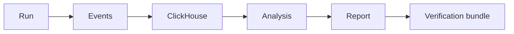

# Логи — это не память: зачем исследовательским проектам ClickHouse и DS/ML-слой

Маленький проект может жить на `print`, истории терминала и паре скриншотов. Исследовательский проект — нет.

Как только в системе появляются версии, sweep-и, traces кандидатов, verdict-ы evaluator-ов, latency, failed runs, penalty curves и воспроизводимые bundle-ы, она перестаёт быть просто программой. Она становится источником экспериментальных данных.

И вот здесь DS/ML-слой становится не украшением, а частью инженерной гигиены.

## Проблема не в хранении. Проблема в памяти.

Логи отвечают на вопрос: что где-то произошло?

Исследовательская база отвечает на вопросы лучше:

- что изменилось после этого коммита?
- какой backend чаще падает?
- какие конфиги быстрее сходятся?
- какие домены чаще вызывают расхождение evaluator-ов?
- какие “успешные” запуски на самом деле загрязнены shortcut-ами?
- какой результат можно воспроизвести через два месяца?

Терминальный лог — это след. Датасет — это память.



## Postgres — это состояние. ClickHouse — это наблюдение.

PostgreSQL отлично подходит там, где системе нужно согласованное состояние: пользователи, задачи, связи, конфиги, метаданные артефактов, очереди, права доступа и прикладные объекты.

ClickHouse рассчитан на другой тип данных: append-only аналитические события. В официальной документации ClickHouse описан как высокопроизводительная колоночная SQL-СУБД для OLAP. OLAP-запросы часто агрегируют большие наборы данных, а колоночное хранение помогает, потому что аналитические запросы обычно читают только часть колонок.

Поэтому мысль не в том, что “ClickHouse вместо Postgres”. Мысль вот в чём:

> Postgres хранит то, чем система является. ClickHouse хранит то, что система делала.

| Слой | Лучше подходит для | Почему |
|---|---|---|
| PostgreSQL | текущего состояния | транзакции, связи, ограничения, целостность |
| ClickHouse | истории событий | append-only метрики, time-series, агрегации, высокий ingest |
| verification-lab | доказательных артефактов | манифесты, хэши, CSV/JSONL, audit-отчёты |

## Почему это важно для исследовательских систем

Возьмём нейросимвольный движок или бинарный вычислительный маршрутизатор. Одного успешного запуска недостаточно. Нужно понимать, как система ведёт себя на множестве запусков.

Для системного проекта вроде Hermes полезные события выглядят так:

```text
run_id
commit_sha
opcode
payload_bytes
response_bytes
latency_ms
crc_ok
backend = lisp | prolog | apl | fallback
status
error_type
```

Для эволюционного движка вроде AGI-lite форма другая:

```text
run_id
version = v7 | v9
domain
seed
candidate_id
ast_size
ast_depth
penalty
fitness
verdict
evaluator
integrity_mode
```

Для обучающей системы вроде Sonata поток снова меняется:

```text
epoch
step
loss
tf_answer_acc
parse_success
format_valid
loop_rate
ar_em
gate_status
```

Это не бизнес-записи. Это наблюдения.

## DS/ML — это не только обучение моделей

В этом контексте DS/ML-инструменты нужны не для модного звучания. Они нужны, чтобы исследователь перестал угадывать.

Минимальный аналитический слой может отвечать на вопросы:

- latency действительно улучшилась или один запуск просто был удачным?
- низкий penalty связан с компактным AST или только с раздуванием дерева?
- новый evaluator реально уменьшил число invalid-кандидатов или просто начал их скрывать?
- большая глубина модели уменьшает loss, но ломает свободную генерацию?
- timeout-ы группируются вокруг одного домена, opcode или коммита?

Это не “big data театр”. Это базовая экспериментальная гигиена.

## Архитектура, к которой я хочу прийти

Чистое разделение выглядит просто:

```text
Engine / Experiment
        ↓
Event logger
        ↓
ClickHouse
        ↓
Python / Polars / notebooks
        ↓
CSV / JSONL / MANIFEST.json
        ↓
verification-lab-1
```

И такое же разделение ответственности:

```text
Postgres          = состояние и связи
ClickHouse        = наблюдения и метрики
verification-lab  = доказательства и reproducibility bundles
```

Для первой итерации достаточно компактной таблицы событий:

```sql
CREATE TABLE experiment_events
(
    ts DateTime64(3),
    project LowCardinality(String),
    run_id String,
    commit_sha String,
    event_type LowCardinality(String),

    metric_name LowCardinality(String),
    metric_value Float64,

    domain LowCardinality(String),
    backend LowCardinality(String),
    status LowCardinality(String),

    config_json String,
    payload_json String
)
ENGINE = MergeTree
PARTITION BY toYYYYMM(ts)
ORDER BY (project, run_id, event_type, ts);
```

Это не финальная схема. Это стартовая точка. На раннем этапе исследовательской инфраструктуры стабильная запись событий важнее идеальной нормальной формы.

## Почему ClickHouse подходит под поток событий

Исследовательская телеметрия обычно:

- дописывается, а не редактируется;
- фильтруется по времени, проекту, run, домену, backend или статусу;
- агрегируется через `count`, `avg`, `quantile`, `countIf` и group-by запросы;
- достаточно широкая, чтобы большинство запросов читали только часть колонок;
- достаточно большая, чтобы “просто погрепать логи” перестало быть серьёзным планом.

Семейство MergeTree в ClickHouse рассчитано на высокий ingest и большие объёмы: insert-ы создают parts, а фоновые merge-и постепенно объединяют их. Такая модель хорошо подходит для событийной телеметрии.

Пример запроса:

```sql
SELECT
    backend,
    quantile(0.95)(metric_value) AS p95_latency_ms,
    countIf(status = 'error') AS errors
FROM experiment_events
WHERE project = 'hermes'
  AND event_type = 'request_completed'
  AND metric_name = 'latency_ms'
GROUP BY backend
ORDER BY p95_latency_ms DESC;
```

Вот такие вопросы хочется задавать постоянно.

## Важная граница: данные ещё не доказательство

ClickHouse может сказать, что произошло. Но он не доказывает, что результат можно публиковать.

Поэтому аналитический слой должен экспортировать доказательные bundle-ы:

```text
verification-lab-1/
  hermes/
    <run_id>/
      MANIFEST.json
      config.json
      events.jsonl
      results.csv
      audit.md
      hashes.txt
```

ClickHouse — это запрашиваемая память. `verification-lab-1` — это воспроизводимое доказательство.

## Настоящая причина всё это делать

Опасность исследовательских проектов не только в том, что система не работает. Опасность в том, что она один раз сработает красиво, случайно — и ты примешь это за закономерность.

DS/ML-слой помогает разделять:

| Выглядит как | Но может быть |
|---|---|
| прогресс | шум |
| discovery | overfit |
| стабильность | один удачный запуск |
| benchmark | demo |
| verification | красивый лог |

Поэтому этот слой важен.

Не потому что каждому проекту нужна enterprise-аналитика. Не потому что каждый график — это наука. А потому что исследовательская система без аналитической памяти в основном помнит последнюю эмоцию разработчика.

Исследовательская система со структурированной телеметрией помнит распределения, регрессии, отказы и доказательства.

## Источники

- [ClickHouse: What is ClickHouse?](https://clickhouse.com/docs/intro)
- [ClickHouse: MergeTree table engine](https://clickhouse.com/docs/engines/table-engines/mergetree-family/mergetree)
- [PostgreSQL: About](https://www.postgresql.org/about/)
