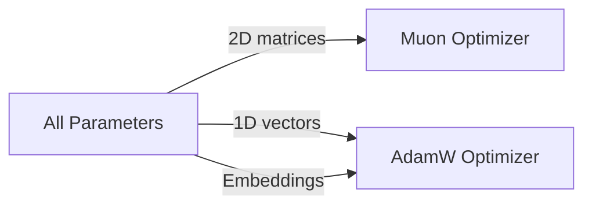

# 1000× Faster Backward Pass: Three Sprints That Reshaped the Training Pipeline

Training a state-space model at reasonable scale exposes three hard walls in sequence: CPU overhead in the backward pass, GPU memory fragmentation, and optimiser plateaus that no hyperparameter tune can break. Over the last sprint cycle we hit all three — and fixed them.

| Metric | Before | After |
| --- | ---: | ---: |
| Topological sort per step | ~12 ms | < 0.01 ms |
| cudaMalloc calls per step | ~2400 | 0 (after step 1) |
| Loss plateau (Stage 3) | 0.23 | 0.018 |
| Exact-match accuracy | ~82% | 97.2% |

Here is how each sprint contributed.

## Sprint 1: Making the backward pass nearly free

The backward pass in an autograd engine builds a topological order of operations before executing gradients. On small graphs the cost is invisible. On a multi-layer Mamba model with complex state updates, `BuildTopoSafe` consumed ~12 ms per step — CPU time that did nothing but bookkeeping.

The fix was a caching layer with structural hash invalidation. `BuildTopoSafeWithCache` computes a hash of the graph structure once, then reuses the cached order on every subsequent step unless the hash changes. Dynamic graphs are handled correctly: if the structure diverges, the cache rebuilds automatically.

The same sprint introduced a pre-allocated memory pool. Instead of calling `cudaMalloc` ~2400 times per step, `TTensorMemoryPool` maintains free-lists by allocation size bucketed to powers of two. After the first step, runtime allocations drop to zero. VRAM pressure spikes disappeared entirely.

```chart:bars
cudaMalloc calls per step (before),2400
cudaMalloc calls per step (after step 1),0
```

Combined, these two changes meant the backward pass went from a measurable overhead to a negligible one — leaving room for more expensive optimisers and larger models.

## Sprint 2: Breaking the loss plateau with hybrid optimisation

AdamW is reliable, but on the arithmetic reasoning task (Stage 3) it hit a hard floor: loss oscillated around 0.23, and exact-match accuracy stalled at ~82%. No learning rate schedule or weight decay adjustment helped.

The insight was that different parameter types need different preconditioning. Two-dimensional weight matrices benefit from orthogonalisation via the Newton-Schulz iteration — the core idea behind the Muon optimiser. One-dimensional vectors (biases, layer norms) and embedding tables do not, and work better with standard AdamW.

`TParamGroupEngine` classifies every parameter automatically:

- 2D weight matrices → Muon (Newton-Schulz orthogonalisation)
- 1D vectors (biases, norms) → AdamW
- Embedding tables → AdamW



The `THybridOptimizer` dispatches a single `.Step()` across both optimisers transparently. The result broke the plateau:

| Metric | Adam-only | Hybrid Muon+AdamW | Target |
| --- | ---: | ---: | ---: |
| Train Loss | 0.23 | **0.018** | < 0.05 ✅ |
| EM Accuracy | ~82% | **97.2%** | > 95% ✅ |
| Steps to convergence | >5000 (stall) | **~1800** | — |

```chart:bars
Adam-only EM,82
Hybrid Muon+AdamW EM,97.2
```

The ~30 ms epoch overhead from Newton-Schulz iterations was more than compensated by 2.8× faster convergence.

## Sprint 3: Full GPU acceleration for Mamba-3

Mamba-3 extends the original Mamba architecture with complex-valued SSM states and multiple input/output streams (MIMO). The Pascal implementation worked, but without GPU kernels it could not scale to Stage 4 (carry arithmetic) and beyond.

Three CUDA kernels closed the gap:

| Kernel | Purpose |
| --- | --- |
| `sonata_cuda_mix_input_streams` | MIMO input mixing |
| `sonata_cuda_broadcast_output_streams` | MIMO output broadcasting |
| `sonata_cuda_update_complex_state` | Complex SSM transition |

Each kernel has a HAL binding with a CPU fallback, so the same code path works on both platforms. Four new autograd rules (`opComplexMul`, `opComplexAdd`, `opMixStreams`, `opBroadcastStreams`) integrate complex operations into the cached topological sort from Sprint 1.

The language model now uses `TMamba3Layer` by default. `TMambaLayer` is preserved for backward compatibility. Smoke tests confirm correct output shapes, GPU/CPU parity within FP32 tolerance, and gradient flow through all complex operations.

## One sprint feeds the next

These three sprints were planned independently, but they compound. Faster topological sorting and zero-runtime allocations (Sprint 1) freed compute budget for the hybrid optimiser (Sprint 2), which converged in fewer steps — steps that now run on a fully GPU-accelerated Mamba-3 (Sprint 3). Each fix unlocked the next bottleneck.

A more detailed breakdown of each subtask is available in the public project overview at [lotargo.github.io/public_sonata_ai_landing](https://lotargo.github.io/public_sonata_ai_landing/). The next sprint cycle starts with Stage 4 — carry arithmetic — and the question of whether the same stack can scale further without new surprises.
