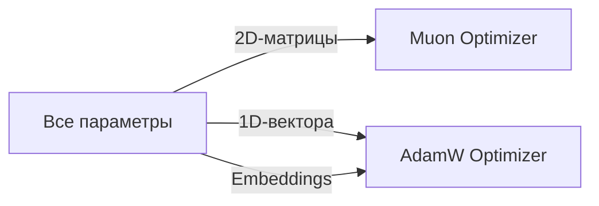

# 1000× быстрее backward pass: три спринта, перестроившие пайплайн обучения

При обучении state-space модели в сколько-нибудь разумном масштабе последовательно упираешься в три стены: CPU-overhead в backward pass, фрагментацию GPU-памяти и плато оптимизатора, которое не пробить никакой настройкой гиперпараметров. За последний спринт мы упёрлись во все три — и починили их.

| Метрика | До | После |
| --- | ---: | ---: |
| Топологическая сортировка за шаг | ~12 мс | < 0.01 мс |
| cudaMalloc вызовов за шаг | ~2400 | 0 (после шага 1) |
| Плато loss (Stage 3) | 0.23 | 0.018 |
| Точность exact-match | ~82% | 97.2% |

Вот что дал каждый спринт.

## Спринт 1: backward pass почти бесплатно

Backward pass в autograd-движке строит топологический порядок операций перед вычислением градиентов. На маленьких графах это незаметно. На многослойной Mamba с комплексными обновлениями состояния `BuildTopoSafe` потреблял ~12 мс за шаг — чистое CPU-время на бухгалтерию.

Решение — кэш с хэш-инвалидацией структуры графа. `BuildTopoSafeWithCache` вычисляет хэш один раз, а на следующих шагах переиспользует закэшированный порядок, если хэш не изменился. Динамические графы обрабатываются корректно: при расхождении структуры кэш перестраивается автоматически.

В этом же спринте появился pre-allocated memory pool. Вместо ~2400 вызовов `cudaMalloc` за шаг, `TTensorMemoryPool` поддерживает free-lists по размерам аллокаций (степени двойки). После первого шага runtime-аллокации падают до нуля. Скачки давления на VRAM исчезли совсем.

```chart:bars
cudaMalloc вызовов за шаг (до),2400
cudaMalloc вызовов за шаг (после шага 1),0
```

Вместе эти два изменения превратили backward pass из измеримого оверхеда в пренебрежимый — освободив вычислительный бюджет для более дорогих оптимизаторов и больших моделей.

## Спринт 2: прорыв плато потерь гибридным оптимизатором

AdamW надёжен, но на задаче арифметического рассуждения (Stage 3) он упёрся в твёрдый пол: loss колебался вокруг 0.23, а точность exact-match застряла на ~82%. Ни подбор learning rate, ни weight decay не помогали.

Идея в том, что разным типам параметров нужна разная предобработка. Двумерным матрицам весов полезна ортогонализация через Newton-Schulz — ключевая идея оптимизатора Muon. Одномерным векторам (biases, нормы слоёв) и embedding tables это не нужно — им достаточно стандартного AdamW.

`TParamGroupEngine` классифицирует каждый параметр автоматически:

- 2D-матрицы весов → Muon (Newton-Schulz ортогонализация)
- 1D-вектора (biases, norms) → AdamW
- Embedding tables → AdamW



`THybridOptimizer` диспатчит единый `.Step()` на оба оптимизатора прозрачно. Результат — плато пробито:

| Метрика | Adam-only | Гибрид Muon+AdamW | Цель |
| --- | ---: | ---: | ---: |
| Train Loss | 0.23 | **0.018** | < 0.05 ✅ |
| EM Accuracy | ~82% | **97.2%** | > 95% ✅ |
| Шагов до сходимости | >5000 (stall) | **~1800** | — |

```chart:bars
Adam-only EM,82
Гибрид Muon+AdamW EM,97.2
```

Дополнительные ~30 мс на эпоху от Newton-Schulz итераций более чем компенсированы 2.8× ускорением сходимости.

## Спринт 3: полное GPU-ускорение Mamba-3

Mamba-3 расширяет исходную архитектуру Mamba комплексными SSM-состояниями и множественными входными/выходными потоками (MIMO). Pascal-реализация работала, но без GPU-ядер не могла масштабироваться на Stage 4 (сложение с переносом) и дальше.

Три CUDA-ядра закрыли разрыв:

| Ядро | Назначение |
| --- | --- |
| `sonata_cuda_mix_input_streams` | MIMO входное микширование |
| `sonata_cuda_broadcast_output_streams` | MIMO выходное вещание |
| `sonata_cuda_update_complex_state` | Комплексный SSM переход |

Каждое ядро имеет HAL-привязку с CPU-fallback, поэтому один и тот же код работает на обеих платформах. Четыре новых autograd-правила (`opComplexMul`, `opComplexAdd`, `opMixStreams`, `opBroadcastStreams`) интегрируют комплексные операции в кэшированную топологическую сортировку из Спринта 1.

Языковая модель теперь использует `TMamba3Layer` по умолчанию. `TMambaLayer` сохранён для обратной совместимости. Smoke-тесты подтверждают корректные формы выходов, GPU/CPU-паритет в пределах FP32 tolerance и прохождение градиентов через все комплексные операции.

## Спринты работают как конвейер

Эти три спринта планировались независимо, но они работают как конвейер: быстрая топологическая сортировка и нулевые runtime-аллокации (Спринт 1) освободили вычислительный бюджет для гибридного оптимизатора (Спринт 2), который сошёлся за меньшее количество шагов — шагов, которые теперь выполняются на полностью GPU-ускоренной Mamba-3 (Спринт 3). Каждый фикс открывал следующий bottleneck.

Более подробная разбивка каждой подзадачи — в публичном обзоре проекта на [lotargo.github.io/public_sonata_ai_landing](https://lotargo.github.io/public_sonata_ai_landing/). Следующий цикл спринтов начинается со Stage 4 — арифметики с переносом — и вопроса, сможет ли тот же стек масштабироваться дальше без новых сюрпризов.
