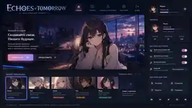
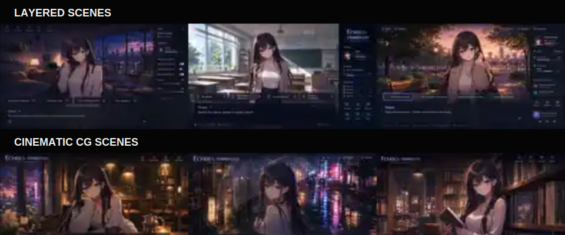

# Visual Novel: Starting an AI Game That Breaks the Fourth Wall

I have started designing a new project at the boundary between an AI chat, a visual novel, and a stateful game. The player should not feel that they opened a dialogue window. They should feel that they entered a character's living space and continued a shared story.

## Not another character chatbot

Most AI character products still inherit the structure of a messenger. Here the scene comes first, while dialogue becomes one of the ways to interact with it.

A character may remember previous visits, greet the player first, refer to shared events, move between locations, change clothing or mood, and offer contextual actions as interface buttons. Proactive behavior remains optional.

> The central object is not the message history. It is the current state of the scene.

## Entering a room instead of opening a thread

When the player opens a character room, the application restores memory, relationships, the current location, time of day, outfit, mood, and unfinished events. If proactive dialogue is enabled, the first line is generated from the character legend, the player's legend, and previous meetings.

## Two visual modes for one continuous scene

The regular visual-novel mode uses independent layers: a reusable background, a transparent character sprite, effects, dialogue, and choices. Important or complex moments switch to a cinematic mode where ComfyUI generates the character and environment as one coherent illustration.

When the episode ends, the application returns to the layered scene without resetting the conversation or world state.

## Generated choices without losing freedom

The system can show two to four generated actions when a situation naturally has several possible responses. The free text field never disappears. Buttons are suggestions, not rails.

## A dialogue model is not enough

The project needs a scene director alongside the character voice. The model may propose dialogue, choices, events, memory candidates, and a structured `scene_patch`, but a deterministic state manager validates and applies changes.

## Music must remember the world too

Music should provide identity to places, characters, relationships, and events, following the narrative role found in strong RPG soundtracks such as _Epic Seven_ and the _Final Fantasy_ series without copying their compositions.

Character themes may have daytime, evening, calm, romantic, tense, and cinematic variations while preserving the same recognizable motif. Music can be produced with Suno, local generators, a DAW, and manual arrangement. Final tracks become normal licensed game assets with loops, stems, and metadata.

## Local, hybrid, and cloud execution

- **Local:** language model, ComfyUI, memory, and assets run on the player's computer.
- **Hybrid:** individual components can be routed independently.
- **Cloud:** remote inference is paid according to actual usage.

Desktop and Steam are the natural primary targets, while a web version remains possible through a DOM interface combined with Canvas or WebGL.

## Three development phases

1. **MVP:** one convincing character, polished UI, several locations, choices, memory, layered/cinematic modes, and a small coherent soundtrack.
2. **Game and visual engine:** scene director, wardrobe, schedules, events, several characters, richer memory, caching, dynamic music, and expanded ComfyUI workflows.
3. **Public release:** desktop/Steam and web distribution, authentication where needed, cloud payments, Docker infrastructure, licensing, privacy, and operational reliability.

## Current status

The project has not yet reached a playable MVP. The repository currently contains the documentation structure, product and subsystem manifestos, visual direction, scene concepts, and initial audio principles. The next step is targeted research and small prototypes before fixing the stack in a plan and implementation checklist.
